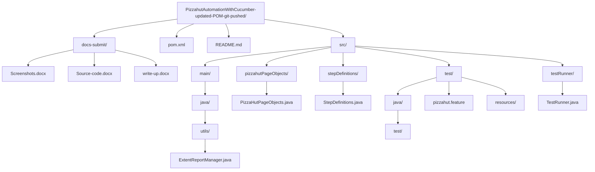

<h1>PIZZA HUT ONLINE AUTOMATION</h1>
<h2>Technologies used: Selenium WebDriver, Core Java, Cucumber, Gherkin, JUnit</h2>

<h3>👉 Project Agenda: To automate functionalities on the pizzahut.co.in website using Selenium WebDriver</h3>
Scenario:

Automate a few functionalities for Pizzahut Onine application.

Design a functionality to automate testing using Selenium and Cucumber or TestNG with a Maven project.

<h2>Tools Required:</h2>
<li>Eclipse / IntelliJ <br></li>
<li>Java 1.8+ <br></li>
<li>Git <br></li>
<li>Cucumber-java maven dependency version 6.8.0<br> </li>
<li>Cucumber-junit maven dependency version 6.8.0 <br></li>
<li>Selenium maven dependency version 4.4.0 <br></li>
<li>TestNG maven dependency version 6.14.3 <br></li>
<li>Extend Report dependency <br></li>

<h2>👉 Expected Deliverables:</h2>
<h3>Test Scenario 1: [Cucumber+JUnit]</h3>
<ol>
  <li>Create a simple maven Project</li>
  <li>Add dependencies in the POM.XML file </li>
  <li>Create a cucumber feature file inside src/test called pizzahut.feature</li>
  <li>Create First scenario in feature file as given below</li>
  [Note: “<>” refers to a parameter]
  <li>In the below scenario “<URL>”, “<Location>” parameters value should be driven from Cucumber Table.</li>
  <li>Use Extend Reporting while each step is PASS/FAIL</li>
</ol>

@Smoke <br>
Scenario Outline: Validate Pizzahut pizza order flow <br>
Given User launch Pizzahut application with "<URL>"<br> 
When User wait for auto location black pop up screen<br> 
Then User close the pop up screen<br> 
And User see pop up for delivery asking for enter location<br> 
Then User type address as "<Location>"<br> 
And User select first auto populate drop down option<br> 
When User navigate to deails page<br> 
Then User validate vegetarian radio button flag is off<br> 
And User clicks on Pizzas menu bar option<br> 
When User select add button of any pizza from Recommended<br> 
Then User see that the pizza is getting added under Your Basket<br>
And User validate pizza price plus Tax is checkout price<br> 
Then User validate checkout button contains Item count<br> 
And User validate checkout button contains total price count<br> 
Then User clicks on Drinks option<br> 
And User select Pepsi option to add into the Basket<br> 
Then User see 2 items are showing under checkout button<br> 
And User see total price is now more than before<br> 
Then User remove the Pizza item from Basket<br> 
And see Price tag got removed from the checkout button<br> 
And User see 1 item showing in checkout button<br> 
Then User Clicks on Checkout button<br>
And User see minimum order required pop up is getting displayed<br>
Examples:<br>
|URL|Location| |https://www.pizzahut.co.in/|lulu mall bangalore|<br>

All Cucumber test data should be parameterized through Feature File scenario table.<br>
Use Page Factory/Page object model for page HTML element.<br>
Close the driver session for the above feature file scenario using Cucumber hooks.<br>
Convert these feature file scenarios into test steps Skeleton.<br>
Create a stepDef file, use this Skeleton method, and implement the test per test automation flow.<br>
Create a testRunner file and run the Cucumber test using it.<br>


<h3>Test Scenario 2:[TestNG+Selenium]</h3>
1.Create a testNG.xml file in the same Maven project<br>
2.Configure a test pizzahut001 inside testNG.xml file<br>
3.Create a new java file for TestNG test implementation<br>
4.Use Extend Reporting while each step is PASS/FAIL<br>
5.Use an Excel Sheet to read application URL [https://www.pizzahut.co.in/]<br>
6.TestNG test steps are given below:<br>
Use @BeforeClass/@BeforeSuite to launch https://www.pizzahut.co.in/<br>
A black color auto pop up screen will be displayed. Close it<br>
Then, set the user delivery location as Lulu Mall, Bangalore<br>
The user is now on the Deals page. Validate that the URL has text as ‘deals’<br>
Go to sides and add any item that is below 200<br>
Validate that the product is added under Basket but checkout button price item is still now showing<br>
Navigate to the Drinks page<br>
Add any two drinks so that total cart pricing is more than 200<br>
Click on the Checkout button. The user will be navigated to the checkout page<br>
Validate that the Online Payment radio button is selected by default<br>
Change the Payment option to Cash<br>
Validate that the I agree checkbox is checked by default<br>
Enter name, mobile, and email address<br>
Click on the Apply Gift Card link<br>
A pop up should appear. Click on the Voucher<br>
Give the Voucher code as 12345 and submit<br>
Validate if an error is coming that the number is incorrect<br>
Close the voucher pop up<br>
The user should again navigate to your Basket page.<br>
Use @AfterClass/@AfterSuite to quit the driver session<br>
Configure testNG.xml to run pom.xml<br>
All test data should be parameterized from testNG.xml<br>
Use page object model to capture page object<br>
Upload the project into Git<br>
Make sure the project is running using the Maven test command<br>

<h2>Project Structure</h2>
<h3>Visual (Mermaid)</h3>


<h3>Quick ASCII tree</h3>
```text
PizzahutAutomationWithCucumber-updated-POM-git-pushed/
├─ docs-submit/
│  ├─ Screenshots.docx
│  ├─ Source-code.docx
│  └─ write-up.docx
├─ pom.xml
├─ README.md
└─ src/
   ├─ main/
   │  └─ java/
   │     └─ utils/
   │        └─ ExtentReportManager.java
   ├─ pizzahutPageObjects/
   │  └─ PizzaHutPageObjects.java
   ├─ stepDefinitions/
   │  └─ StepDefinitions.java
   ├─ test/
   │  ├─ java/
   │  │  └─ test/
   │  ├─ pizzahut.feature
   │  └─ resources/
   └─ testRunner/
      └─ TestRunner.java
```